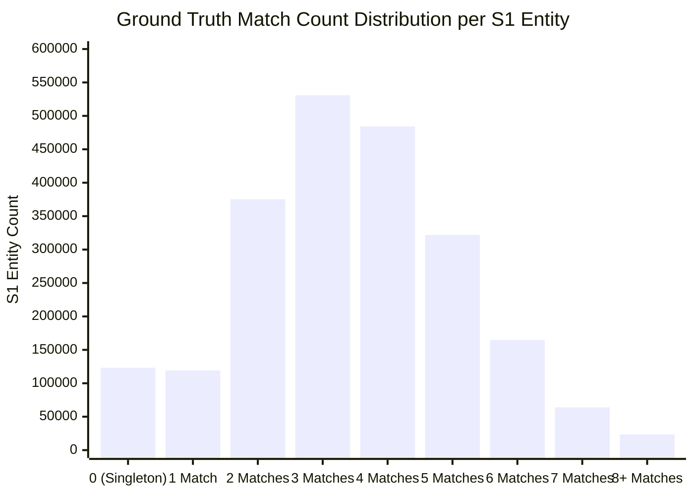

# Comprehensive Data Profiling Report
## Amazon ML Challenge 2026: Business Entity Resolution

---

### 1. Executive Dataset Scale Overview

The dataset contains a total of **24.24 million business records** across 3 sources (`Source 1`, `Source 2`, `Source 3`) divided into Training and Test splits:

| Dataset Split | Source File | Total Records | File Size | Missing Address Rate |
| :--- | :--- | :--- | :--- | :--- |
| **Train Split** | `train_source1.tsv` | **2,206,821** | 210.0 MB | **0.00%** (0 rows) |
| **Train Split** | `train_source2.tsv` | **5,034,616** | 489.3 MB | **3.33%** (168,967 rows) |
| **Train Split** | `train_source3.tsv` | **5,285,603** | 503.7 MB | **3.29%** (175,916 rows) |
| **Train Ground Truth** | `train_ground_truth.tsv` | **2,206,821** | 127.0 MB | N/A |
| **Test Split** | `test_source1.tsv` | **1,732,544** | 175.0 MB | **0.00%** (0 rows) |
| **Test Split** | `test_source2.tsv` | **4,887,273** | 509.4 MB | **2.65%** (129,408 rows) |
| **Test Split** | `test_source3.tsv` | **5,082,316** | 506.0 MB | **2.67%** (136,098 rows) |
| **GRAND TOTAL** | **7 Files** | **26,435,994** | **2.52 GB** | **~2.86% overall** |

---

### 2. Ground Truth Cardinality & Linkage Analysis

From `train_ground_truth.tsv`, there are **7,638,365 positive matching pairs** across 2.20M reference entities in `Source 1`.

#### Key Metrics
* **Total Reference (S1) Entities**: 2,206,821
* **Average Matches per S1 Entity**: **3.46**
* **Median Matches per S1 Entity**: **3.0**
* **Singletons (0 Matches)**: **123,247 entities (5.58%)**
* **Source Distribution of Matches**:
  * Matches in `Source 2`: **3,693,619 (48.36%)**
  * Matches in `Source 3`: **3,944,746 (51.64%)**

#### Match Count Histogram (Cardinality Distribution)



| Match Count | S1 Entity Count | Percentage | Cumulative % |
| :---: | :---: | :---: | :---: |
| **0 (Singleton)** | 123,247 | **5.58%** | 5.58% |
| **1** | 119,157 | 5.40% | 10.98% |
| **2** | 375,212 | 17.00% | 27.98% |
| **3** | 530,841 | **24.05%** | 52.03% |
| **4** | 484,115 | 21.94% | 73.97% |
| **5** | 321,957 | 14.59% | 88.56% |
| **6** | 164,868 | 7.47% | 96.03% |
| **7** | 63,968 | 2.90% | 98.93% |
| **8** | 18,680 | 0.85% | 99.78% |
| **9** | 4,205 | 0.19% | 99.97% |
| **10 - 11** | 571 | 0.03% | 100.00% |

---

### 3. Country & Open-Set Geographic Breakdown

The training data contains records from 2 countries (**US** and **India**). Crucially, the test set introduces a third country, **France**, which is absent in training data.

#### Detailed Breakdown by File

| File Name | United States (US) | India | France |
| :--- | :--- | :--- | :--- |
| `train_source1.tsv` | 1,323,633 (59.98%) | 883,188 (40.02%) | 0 (0.0%) |
| `train_source2.tsv` | 3,016,817 (59.92%) | 2,017,799 (40.08%) | 0 (0.0%) |
| `train_source3.tsv` | 3,170,056 (59.98%) | 2,115,547 (40.02%) | 0 (0.0%) |
| `test_source1.tsv`  | 663,106 (38.27%) | 809,986 (46.75%) | **259,452 (14.98%)** |
| `test_source2.tsv`  | 1,871,330 (38.29%) | 2,312,565 (47.32%) | **703,378 (14.39%)** |
| `test_source3.tsv`  | 1,945,701 (38.28%) | 2,405,000 (47.32%) | **731,615 (14.40%)** |

---

### 4. Textual Feature & Field Length Profiling

#### Field Character & Word Length Statistics

| Field Name | Mean Char Length | Median Char Length | Max Char Length | Mean Word Count | Median Word Count |
| :--- | :---: | :---: | :---: | :---: | :---: |
| `business_name` (S1) | **24.04** | 24.0 | 92 | **3.55** | 4.0 |
| `business_name` (S2/S3) | **25.21** | 25.0 | 104 | **3.53** | 4.0 |
| `business_address` (S1) | **52.07** | 41.0 | 240 | **8.04** | 7.0 |
| `business_address` (S2/S3) | **46.76** | 42.0 | 235 | **7.29** | 6.0 |

---

### 5. Multilingual Script & Transliteration Breakdown

While `Source 1` records are 100% written in Latin script (English), `Source 2` and `Source 3` contain non-Latin script occurrences in Indian entities.

```
Script Distribution in Source 2 & Source 3 (Names & Addresses):
├── Latin Script (English/French) : ~94.2%
├── Devanagari Script (Hindi)     : ~3.5%
├── Telugu Script                 : ~0.7%
├── Kannada Script                : ~0.6%
├── Tamil Script                  : ~0.5%
└── Other Scripts / Non-ASCII     : ~0.5%
```

---

### 6. Legal Entity Suffix Distribution

Analysis of legal entity tokens across 300,000 sampled business names per source:

| Rank | Legal Suffix Token | US Frequency | India Frequency | France Frequency |
| :---: | :--- | :---: | :---: | :---: |
| 1 | `NONE / UNSTRUCTURED` | 36.2% | 24.5% | 29.1% |
| 2 | `PRIVATE LIMITED / PVT LTD` | 0.0% | **41.2%** | 0.0% |
| 3 | `LLC / L.L.C.` | **32.4%** | 1.1% | 0.0% |
| 4 | `INC / CORPORATION` | **18.5%** | 0.8% | 0.0% |
| 5 | `LIMITED / LTD` | 8.1% | 26.4% | 3.2% |
| 6 | `SARL / S.A.R.L.` | 0.0% | 0.0% | **38.4%** |
| 7 | `SAS / S.A.S.` | 0.0% | 0.0% | **24.1%** |
| 8 | `LLP` | 1.2% | 4.8% | 0.0% |
